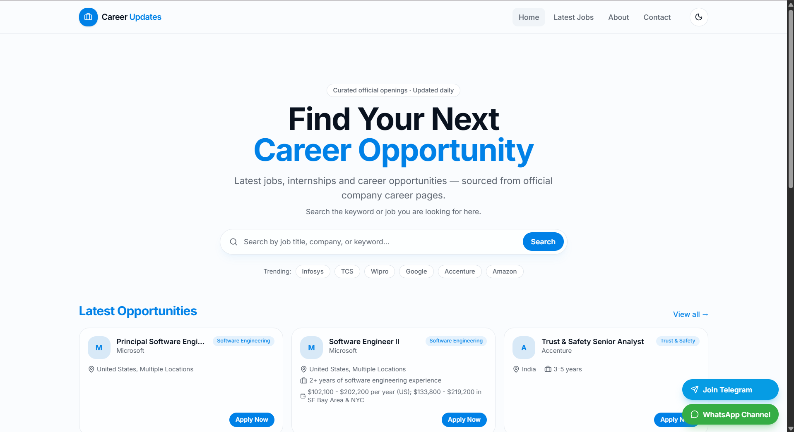
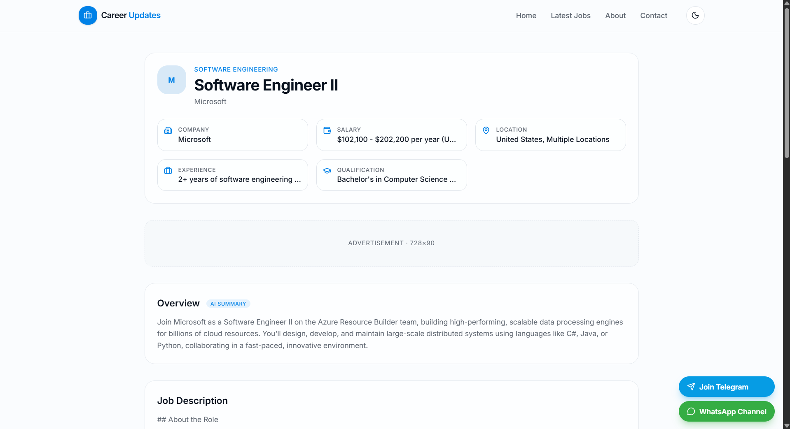
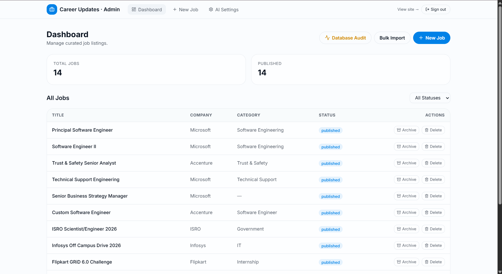
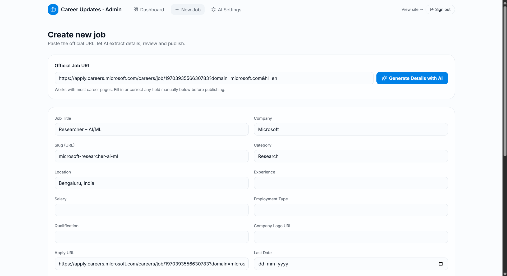
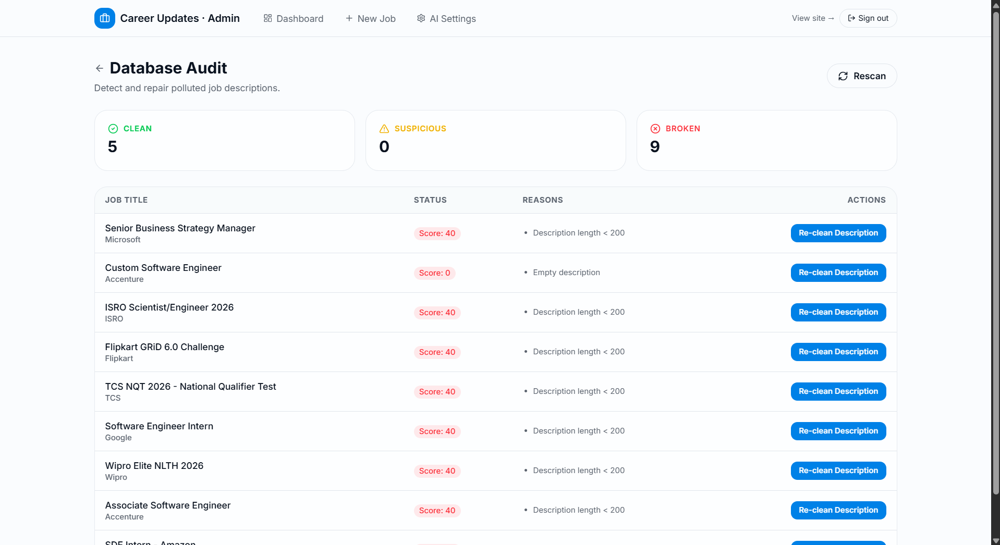
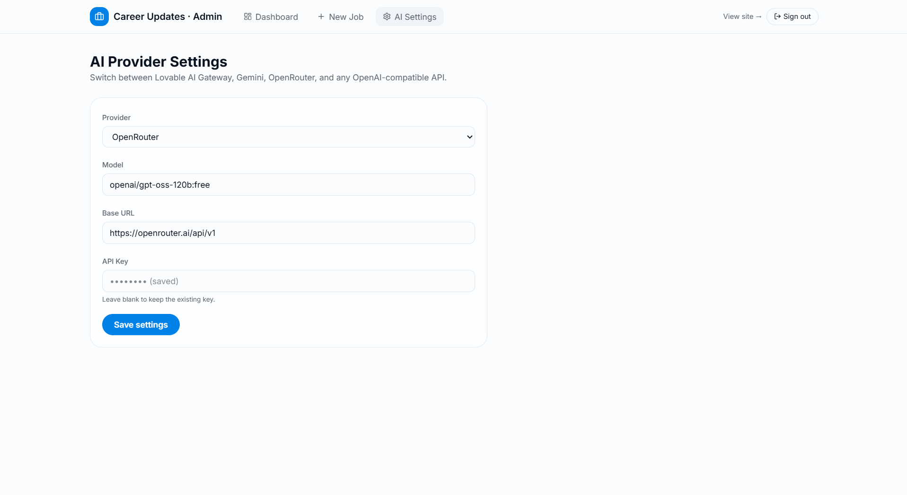
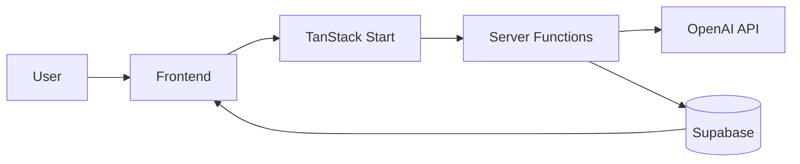
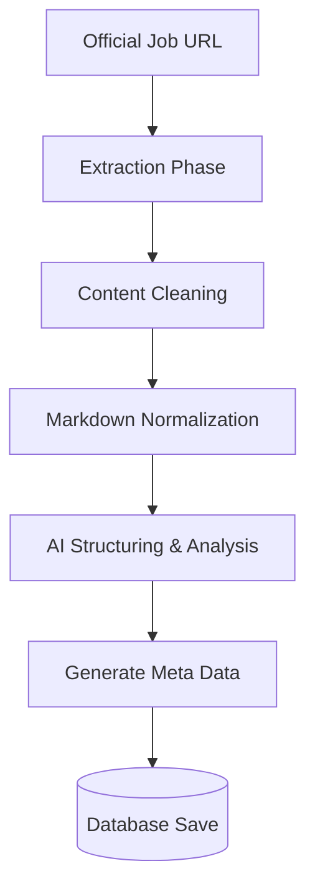

<div align="center">
  

  <h1>🚀 CareerUpdates</h1>
  
  <p><strong>AI-Powered Job Discovery, Curation and Publishing Platform</strong></p>

  <p>
    CareerUpdates automatically extracts job information from official career pages, cleans polluted content, generates AI-powered summaries, SEO metadata and publishes curated job listings.
  </p>

  <p>
    
    
    
    
    
    
  </p>
</div>

---

## 🌍 Live Demo

Experience the platform live:

**[Live Demo](https://your-domain.com)**

---

## 📸 Screenshots

<details>
<summary><strong>View Application Screenshots</strong></summary>

### Public Interface

**Homepage**


**Job Details**


### Admin Interface

**Admin Dashboard**


**New Job/AI Import**


**Database Audit System**


**AI Settings & Configuration**


</details>

---

## ✨ Features

### 🌐 Public Features
- **Job Listings:** Browse curated job opportunities with fast, seamless navigation.
- **Search:** Instant, type-ahead search to find the perfect role.
- **SEO Pages:** Optimized routing and metadata for every listing.
- **Responsive Design:** Flawless experience across mobile, tablet, and desktop.
- **Job Detail Pages:** Comprehensive views with AI-generated summaries.
- **Social Sharing:** Easily share jobs with Open Graph image support.

### 🛡️ Admin Features
- **AI Job Import:** Simply paste a URL and let AI do the rest.
- **Bulk Import:** Process multiple URLs or CSVs simultaneously.
- **Database Audit:** Identify broken links or low-quality listings.
- **Re-clean Descriptions:** Fix formatting issues with a single click.
- **AI Summary Regeneration:** Update outdated summaries dynamically.
- **SEO Metadata Generation:** Auto-create titles, descriptions, and tags.

### 🧠 AI Features
- **Job Extraction:** Pull structured data from unstructured career pages.
- **Content Cleaning:** Remove tracking pixels, boilerplate, and HTML clutter.
- **Markdown Normalization:** Standardize job descriptions into clean Markdown.
- **Summary Generation:** Provide tl;dr bullet points for quick scanning.
- **Meta Description Generation:** Optimize descriptions for search engines.
- **Tag Generation:** Automatically categorize jobs by skills and roles.

---

## 🏗️ Architecture

### High-Level Application Architecture



### AI Extraction Pipeline



> **Note:** For more details, see the [Architecture Documentation](docs/architecture.md) and [AI Pipeline Documentation](docs/ai-pipeline.md).

---

## 💻 Tech Stack

| Category | Technology | Description |
|----------|------------|-------------|
| **Frontend** | React, TanStack Start | Fast, reactive UI with file-based routing |
| **Backend** | Server Functions | Serverless logic integrated with routing |
| **Database** | Supabase (PostgreSQL) | Scalable backend with real-time capabilities |
| **Authentication**| Supabase Auth | Secure, session-based user management |
| **AI** | OpenAI (GPT-4) | Intelligent extraction, cleaning, and formatting |
| **Deployment** | Vercel | Global edge network for zero-config deployments |

---

## 📂 Folder Structure

```text
careerupdates/
├── app/
│   ├── routes/
│   │   ├── admin/          # Protected admin dashboard and tools
│   │   ├── jobs/           # Public job detail pages
│   │   ├── index.tsx       # Homepage
│   │   └── __root.tsx      # Root layout
│   ├── components/         # Reusable UI components
│   ├── server/             # Server functions & API routes
│   └── utils/              # Helper functions & AI utilities
├── public/                 # Static assets
├── docs/                   # Documentation & diagrams
├── .env.example            # Environment variables template
├── package.json
└── tsconfig.json
```

---

## 🔑 Environment Variables

To run this project locally, you will need to add the following environment variables to your `.env` file:

| Variable | Description |
|----------|-------------|
| `VITE_SUPABASE_URL` | Public URL for the Supabase project (used by client) |
| `VITE_SUPABASE_PUBLISHABLE_KEY` | Public API key for Supabase (used by client) |
| `SUPABASE_URL` | Private URL for the Supabase project (used by server) |
| `SUPABASE_PUBLISHABLE_KEY` | Private API key for Supabase (used by server) |
| `OPENAI_API_KEY` | Your OpenAI API key for data extraction and cleaning |

---

## 🛠️ Local Development

1. **Clone the repository**
   ```bash
   git clone https://github.com/nithingoud78/CareerUpdates.git
   cd CareerUpdates
   ```

2. **Install dependencies**
   ```bash
   npm install
   ```

3. **Set up environment variables**
   ```bash
   cp .env.example .env
   # Add your keys to the .env file
   ```

4. **Run the development server**
   ```bash
   npm run dev
   ```

5. **Open your browser**
   Navigate to `http://localhost:3000`

---

## 🚀 Build & Deployment

### Build for Production
```bash
npm run build
```

### Deploy to Vercel
This project is optimized for deployment on Vercel. 

1. Push your code to GitHub.
2. Import the project in Vercel.
3. Add the environment variables in the Vercel dashboard.
4. Deploy!

> **Note:** For comprehensive deployment instructions, view the [Deployment Guide](docs/deployment.md).

---

## 📊 Database Audit System

Maintaining high-quality job listings is crucial. CareerUpdates features a robust Database Audit System built right into the admin panel:

- **Quality Scoring:** AI evaluates and scores the completeness of every listing.
- **Broken Jobs:** Automatically flags URLs that return 404s or have expired.
- **Suspicious Jobs:** Identifies potentially fraudulent or low-effort postings.
- **Clean Jobs:** Distinguishes fully formatted, high-quality records.
- **Re-clean Description:** A one-click utility to fix markdown formatting or re-generate summaries for legacy listings.

---

## 🔍 SEO Features

Built from the ground up for search engine visibility:

- **Open Graph Support:** Dynamically generated OG images and tags for Twitter/LinkedIn sharing.
- **Dynamic Meta Tags:** AI-generated SEO titles and descriptions for every job page.
- **Sitemap Generation:** Automated `sitemap.xml` for instantaneous indexing.
- **Robots.txt:** Optimized crawler directives.
- **Structured Data:** JSON-LD JobPosting schema injected into every listing.

---

## ⚡ Performance

- **Route-level Code Splitting:** Only loads the JS required for the current page.
- **Lazy-loaded Admin Pages:** Heavy admin dependencies never pollute the public bundle.
- **Server-Side Rendering (SSR):** Instant first paint and perfect SEO.
- **Static Assets:** Cached efficiently at the edge.

---

## 🗺️ Roadmap

- [ ] **User Accounts:** Allow job seekers to create profiles.
- [ ] **Saved Jobs:** Let users bookmark interesting positions.
- [ ] **Job Alerts:** Email notifications for specific keywords or roles.
- [ ] **Telegram Automation:** Auto-post new, high-quality jobs to a Telegram channel.
- [ ] **Analytics Dashboard:** Insights on job views, clicks, and applications.

---

## 👨‍💻 Author

**Nithin Goud**
- GitHub: [@nithingoud78](https://github.com/nithingoud78)

---

## 📄 License

This project is licensed under the MIT License - see the [LICENSE](LICENSE) file for details.
