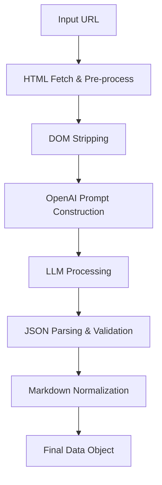

# AI Extraction & Cleaning Pipeline

The core value proposition of CareerUpdates is its ability to take noisy, unstructured job postings from the web and transform them into clean, structured, and standardized database records.

This document outlines the step-by-step pipeline.

## Pipeline Architecture



## 1. Ingestion & Pre-processing

When an admin submits a URL:
1. **Fetch:** A server function fetches the raw HTML of the target page.
2. **DOM Stripping:** We use an HTML parser (like `cheerio` or `jsdom`) to remove `<script>`, `<style>`, `<nav>`, `<footer>`, and other boilerplate tags.
3. **Text Extraction:** We extract the core `innerText` or clean HTML of the main content area to reduce token usage.

## 2. The LLM Prompt Strategy

We utilize OpenAI (GPT-4 recommended for complex reasoning) with a strict System Prompt enforcing JSON output.

### System Prompt Example
```text
You are an expert HR data extraction assistant. 
Your task is to analyze the provided text from a job posting and extract the information into a strict JSON format.
Ignore company marketing fluff and focus on the role, requirements, and benefits.

Required JSON structure:
{
  "title": "Job Title",
  "company_name": "Company",
  "location": "City, State or Remote",
  "salary_range": "extracted or null",
  "description_markdown": "Full description cleaned and formatted in Markdown",
  "summary_bullets": ["3-5", "key", "takeaways"],
  "seo_meta_description": "A compelling 150-character summary for search engines",
  "tags": ["skill1", "skill2", "role_type"]
}
```

## 3. Processing Stages

### Content Cleaning
The LLM is instructed to rewrite the `description_markdown` field. It removes tracking links, fixes weird line breaks, standardizes bullet points, and ensures headers (H2, H3) are used correctly.

### Summary Generation
Instead of forcing users to read a 1,000-word description, the LLM generates `summary_bullets`—a high-signal tl;dr of the role.

### SEO Metadata Generation
The LLM crafts an `seo_meta_description` specifically designed to improve click-through rates on Google.

## 4. Validation & Storage

1. **Validation:** The returned JSON is parsed and validated against a schema (e.g., using Zod) to ensure all required fields are present and correctly typed.
2. **Audit Flagging:** If the LLM indicates it couldn't find a job title or the description is too short, the system automatically flags the entry in the **Database Audit System** as `Suspicious`.
3. **Storage:** The clean record is inserted into Supabase, ready for immediate publication or manual review.

## 5. Re-cleaning Mechanism

If a job was imported poorly (e.g., formatting errors), admins can trigger a "Re-clean" from the dashboard. This skips the ingestion phase and passes the existing dirty database markdown back through steps 2-4 with a specialized correction prompt.
