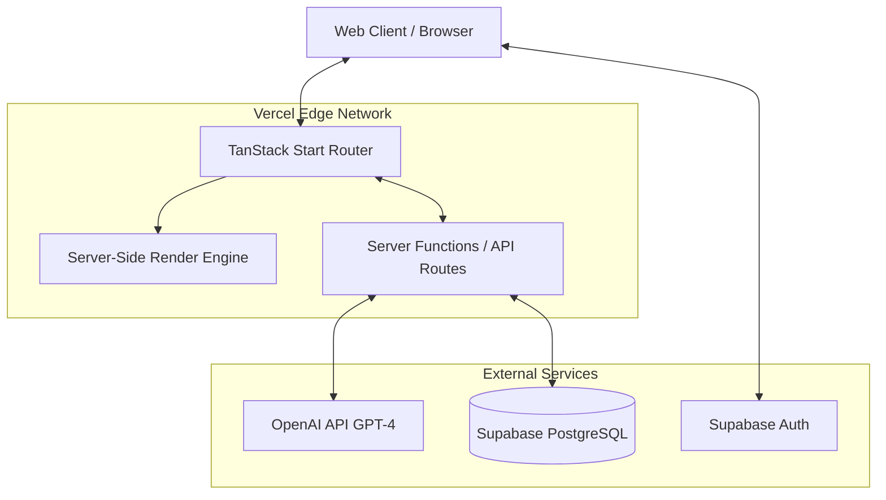

# System Architecture

The CareerUpdates platform is designed as a modern, serverless web application optimized for performance, SEO, and seamless AI integration.

## High-Level Overview

CareerUpdates uses a unified framework approach, leveraging TanStack Start to handle both client-side interactivity and server-side operations in a single cohesive codebase.

## Core Components

### 1. Frontend (TanStack Start + React)
- **File-based Routing:** Manages complex nested layouts and data fetching.
- **Server-Side Rendering (SSR):** Crucial for SEO, ensuring search engines can parse the fully populated job listings without executing JavaScript.
- **Hydration:** React takes over on the client side to provide interactive search, filtering, and admin capabilities.

### 2. Backend (Server Functions)
- **Data Loaders:** Securely fetch data from Supabase before rendering the page.
- **Server Actions:** Handle form submissions, authentication flows, and AI processing triggers without exposing API keys to the client.

### 3. Database & Auth (Supabase)
- **PostgreSQL:** Stores jobs, companies, tags, and audit logs.
- **Row Level Security (RLS):** Ensures that only authenticated admins can trigger imports, edits, or audits, while public users have read-only access to published jobs.
- **Edge Functions (Optional):** Can be utilized for scheduled tasks (e.g., cron jobs to check for broken links).

### 4. AI Engine (OpenAI)
- **Processing Layer:** Acts as an intelligent middleware. It takes raw HTML/Text from external URLs and returns structured JSON conforming to our database schema.

## Data Flow: Viewing a Job

1. User navigates to `/jobs/123-software-engineer`.
2. TanStack Start server intercepts the request.
3. Server function queries Supabase for job ID `123`.
4. Data is returned and injected into the React component tree.
5. The page is rendered to HTML on the server.
6. HTML is sent to the client (fast First Contentful Paint).
7. React hydrates, enabling interactive elements (share buttons, apply links).
